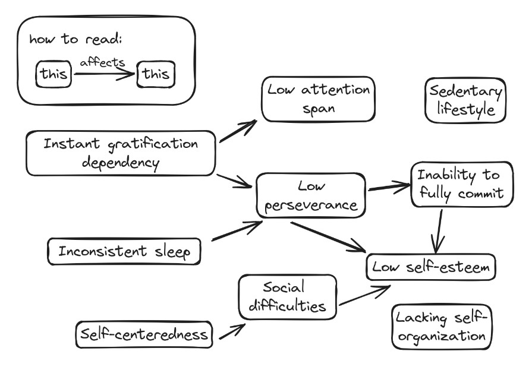

+++
title = "version 0.1.0 - current situation & start"
date = 2024-06-19
draft = false
+++

Hi, I'm Kiro (21M), and my life is a bit of a mess. 

# Life, lately.

Starting about 5 years ago, I've been doing the absolute bare minimum to live and "going with the flow." 

Life has roughly been a repetitive cycle of:
- Wake up
- Seek activities that bring instant gratification
- (Make)/Eat lunch
- Seek activities that bring instant gratification
- (Make)/Eat dinner
- Seek activities that bring instant gratification
- Sleep

In the above schedule, when I refer to "activities that bring instant gratification," I mean things like the following (ranked in order of severity):
- Watching YouTube
- Doomscrolling Instagram Reels
- Browsing news
- Browsing online stores

If a deadline approaches, I would just study intensely or do the assignment for about 3-5 hours the night before it's due. This has an unreasonably decent success rate, but it is a horrible habit and it won't work forever.

# Problem set

After thoroughly reflecting on what my life has become, I have come up with the following list of things I would like to fix. 

1. Extremely inconsistent sleep schedule
	- **Current situation:** I tend to gravitate towards sleeping at 4-5 AM, but occasionally shift back to around midnight. My average sleep schedule in 2024 so far has been a sleeping time of 3:20 AM and a wake-up time of 9:53 AM. However, these times often fluctuate by up to ±2.5 hours. 
2. Dependency on instant gratification
	- **Current situation:** I've been absolutely hooked on mainly YouTube and/or Instagram. I'm specifically very vulnerable to short-form content doomscrolling. I can avoid it upon waking up, but I tend to get hooked after the following triggers:
		- Instagram: Seeing the app icon in my app list or checking the app after receiving a message from someone.
		- YouTube: Checking recommended videos on the sidebar after/while watching a video for learning purposes.
	- **Current countermeasures:** 
		- If I do have Instagram installed, I have it hidden away from my app drawer and installed a minimalist launcher such that none of my app's icons are visible when scrolling through my app list. Otherwise, it's uninstalled.
		- I have uninstalled the YouTube app from my phone and use a website blocker to block it on the browser. However, disabling and re-enabling the blocker is something I do often. If I do need to watch a very specific video, I can search the video title in a search engine and watch it directly in the videos tab. This way, I don't get recommendations and can access specific videos despite the active blocker.
3. Inability to fully commit
	- **Current situation:** It has been about 7 years since I was last able to put my full 100% into doing any one thing. I feel like this is because I'm unconsciously creating the excuse of "I failed because I half-assed it." In other words, I'm very prone to being distracted and sidetracked.
4. Low perseverance
	- **Current situation:** I have been unable to do anything, no matter how small, consistently for an extended period of time (>1 month), be it exercise, studying, etc. This is because I tend to give up easily when I need to engage in activities that strain me mentally or physically.
5. Difficulty gaining/maintaining/deepening friendships (aka social difficulties)
	- **Current situation:** I only realized about 4 years ago that my social health was actually important. As such, I'm a bit late when it comes to learning how to socialize and how friendships work. 
		- Gaining friendships: Having conversations with me is pretty difficult (especially in real life) and regularly turns into silence unless you share a lot of interests with me, but that's extremely rare as I'm not interested in most mainstream things. I also struggle with taking a genuine interest in people, and I feel like I'm very easily forgettable.
		- Maintaining friendships: I try to check up on people I know sometimes, but a lot of the time, it feels like a one-way street. Friendships sometime feel like a single-player game, where I only get a response if I do something first. Then again, maybe I'm just not reaching out to enough people.
		- Deepening friendships: I currently do not have any close friends, and all the conversations I have are usually very shallow in depth, like small talk. I feel like I lack the social experience needed to engage in more vulnerable topics.
		As a consequence of all this, feeling lonely is a common occurrence.
6. Self-centeredness
	- **Current situation:** I am really bad at paying attention when it comes to things I'm not interested in. I only partake in things only if I like them. Additionally, during conversations, I constantly fail to empathize with other people, I have the bad habit of always wanting to one-up someone else's experience, and I also have the bad habit of somehow making a conversation about me. I feel like I don't really listen when the conversation isn't about me.
7. Very sedentary lifestyle
	- **Current situation:** I spend the vast majority of my day either at my computer or in bed. I seldom exercise. My average step count is around 3k if I don't go outside, and about 5k if I do.
8. Low self-esteem
	- **Current situation:** I don't really contribute to society, and due to my lack of perseverance, my confidence in my ability to get anything done constantly goes down. It feels like I always overpromise and underdeliver. I have a roof over my head, food on the table, and stable finances. Tons of people could achieve way more things if they were in my shoes, yet here I am, rotting away.
9. Low attention span
	- **Current situation:** Due to constantly consuming content, I feel like I won't pay attention to anything unless the information is basically spoon-fed to me. This has caused me a lot of difficulty academically (lectures effectively put me to sleep) and socially (I am a horrible listener).
10. Lacking self-organization skills
	- **Current situation:** I only use a calendar to keep track of important events. Keeping track of tasks, deadlines, etc are basically not done at all, causing a lot of things to be done last-minute. Tasks sometimes build up without my knowledge to the point that they become overwhelming. I'm often scared to take on opportunities as I feel like I'll be too disorganized to follow through.

There are some pretty obvious connections between the problems, as well as some links I've realized over the years. The ones I'm aware of are as follows:

Note that this isn't a professional diagnosis or anything, but it's simply my own observations about myself.
# Previous attempts

I have previously attempted to get certain aspects of my life together, which are listed here in chronological order.
- Journaling 
	- I tried this in an attempt to vent frustrations in hopes of being able to stop thinking about my problems and therefore would be able to focus on more important, present things. However, I eventually realized that my life was in a really boring cycle, and thus there was not much to journal. This made maintaining consistency hard, and so I ultimately gave up.
- Using self-organization apps
	- This was done to make tasks easier to do, as it would take the "what should I do now" out of the process of getting things done. This was very effective at first, but eventually, tasks piled up to the point that they became visually overwhelming, and some tasks took entire days to complete. These two reasons led to me avoiding the apps and giving up.
- Using habit trackers
	- This was done to make/break bad habits, but checking in on the app on a daily basis was quite difficult as I kept forgetting. The main issue was actually when tracking habits that had to be done on a non-daily basis (like once every 2-3 days), as I kept forgetting to do them. As I kept forgetting, this ended up being a way for me to beat myself up over consistently failing to do things consistently, eventually leading to me quitting tracking habits.

# New approach

To tackle my problems for (hopefully) the last time, I want to use the approach of assessing my current issues, planning out a set of actions to take for a set time frame, and repeating as many times as required. All this will be documented in this series of posts, in hopes of reminding me of the progress I've made so far.

Each post will give updates on the goals of the last post, set new goals, and have updates. I'm hoping for posts to be done once every 4 or so weeks, and updates being done weekly. Post titles will have a [semantic versioning](https://semver.org/)-like label, such that:
- version x.x.0 -> x.x.1 means a patch is being made. 
	- That is, the goal wasn't met satisfactorily and some changes need to be made.
- version x.1.x -> x.2.0 means a minor change has been successfully made. 
	- That is, the goal was met, and new actions can be taken to fix other problems.
- version 0.x.x -> 1.x.x means a major change has been successfully made. 
	- By this point, all of the problems I listed above should be mitigated to some extent, thus marking the end of this series. I may continue version 2.x.x onwards in another chain of posts.

This time, the overarching goal isn't to become a crazy productive workaholic or anything like that, but rather to establish a new baseline for my daily life that makes further self-development possible. That's why this series is called "recovery."

# Next goal

For now, my priority is to restore some perseverance. To do this, I will be trying to achieve the following things for the next 28 days (4 weeks):
- Cutting off YouTube and Instagram entirely by blocking/uninstalling them.
	- If I need videos, I will only accessing the ones I need to through a search engine's videos tab as mentioned previously.
	- As alternatives, I am allowed to listen to podcasts and music, and I will be able to read books instead. I feel like these activities are much less addicting than video-based content, so it's at least a step in the right direction.
	- **Condition to fulfill:** Do not circumvent blockers or install social media for the full duration.
- Getting into bed by midnight
	- This doesn't mean that I need to fall asleep by midnight, but rather I need to be in bed by then. I'm on summer break, so a set wake-up time will not be enforced.
	- **Condition to fulfill:** Get in bed on time on at least 21 of the 28 days.

# Updates

Small updates will be posted below on a weekly basis for the first 3 weeks. 

**26.06.24** - Week 1

Goal progress
- No YT/IG - 7/7 (🗸🗸🗸🗸🗸🗸🗸)
- Bed by midnight - 5/7 (✗🗸🗸🗸🗸🗸✗)

The first couple days were the hardest. Time felt excruciatingly slow, and my lack of social interaction was put in full frame when I had nothing to do. I managed to pull through with the help of some podcasts, music, and playing tetris, but using them extensively may be problematic.

I started creating more social appointments with others, but when I'm not with others, my mental state does take a nosedive. Fortunately, keeping myself busy with tasks has helped to somewhat mitigate it, although my lack of self-organization makes figuring out what to do a challenge.

All that said, I can definitely notice some positive effects so far:
- I feel like my attention span has definitely been extended; I can now do things for longer without getting distracted. It has also certainly helped with socializing, but listening attentively is still challenging.
- My sleep has been really good; I don't wake up feeling ultra lethargic anymore, and my body automatically wakes up at around 9 AM.
- I can maintain strong focus when doing larger tasks in bursts of ~1 hour time blocks, which I haven't been able to do in a while.
- Getting started with doing things has become less challenging.

Results are better than expected so far, but I hope I'll be able to effectively mitigate the undesirable side-effects soon.